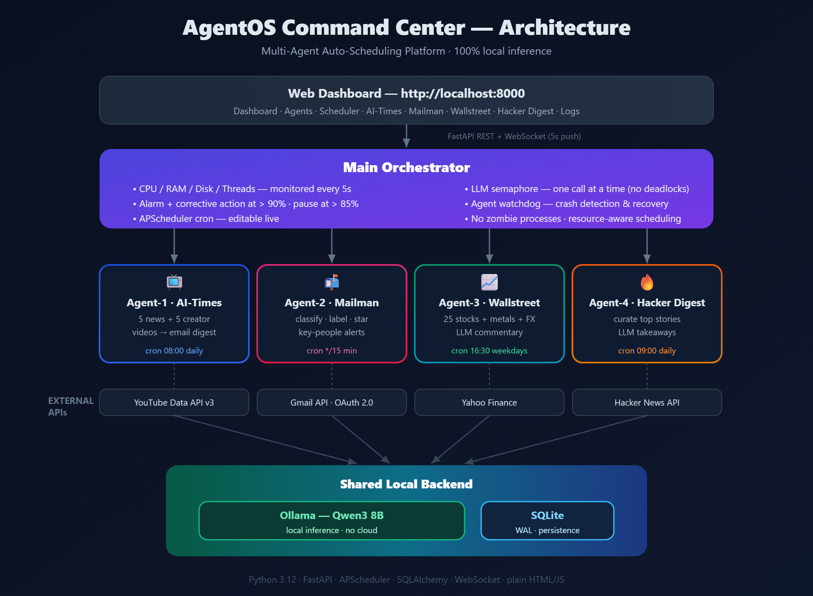

# ⚡ AgentOS Command Center
### Multi-Agent Auto-Scheduling Platform — powered by a local LLM

A fully operational, **100% local** multi-agent AI platform. A central orchestrator manages four specialized autonomous agents, monitors system resources, schedules work, and serves a real-time operations dashboard. **Every bit of AI inference runs on your own machine** via **Qwen3 on Ollama** — no cloud APIs, no per-token billing, no data leaving your network.



---

## 🎥 Demo Video

**▶ Watch the full demo (all 5 agents running live):** https://youtu.be/vLkWbJ53Gkw

[](https://youtu.be/vLkWbJ53Gkw)

---

## 📌 Use-Case Proposal (Agent-4 — Hacker Digest)

> *~150 words — the required proposal for the custom "Your Choice" agent.*

AgentOS Command Center tackles a problem every organization faces: knowledge workers lose two to three hours daily to repetitive information work — triaging email, scanning markets, and reading industry news. Our custom agent, **Hacker Digest**, demonstrates the solution. Software engineers suffer constant information overload from Hacker News, where hundreds of stories compete for attention and reading everything is impossible. Hacker Digest autonomously fetches the top stories through the free Hacker News API, then uses the local Qwen3 model to generate a concise "why this matters to an engineer" takeaway for each, delivering a curated email digest every morning. It eliminates the twenty-minute daily scroll and the fear of missing critical developments, surfacing only what is relevant with instant rationale. Story count and curation depth are configurable live from the dashboard. Because all inference runs locally, it costs nothing per run and no browsing data ever leaves the machine.

---

## 📑 Table of Contents
- [What It Does](#-what-it-does)
- [Architecture](#-architecture)
- [Tech Stack](#-tech-stack)
- [Quick Start](#-quick-start-from-scratch)
- [Configuration](#-configuration)
- [The Agents](#-the-agents)
- [Dashboard](#-dashboard)
- [Key Design Decisions](#-key-design-decisions)
- [Project Structure](#-project-structure)
- [Security](#-security)

---

## 🎯 What It Does

Knowledge workers lose **2–3 hours every day** to email triage, market-watching, and news-scanning. AgentOS automates that work with a team of tireless AI agents that run 24/7 in the background — while keeping all data and inference **on-premise**:

| Layer | Responsibility |
|---|---|
| **Main Orchestrator** | Manages all agents; monitors CPU/RAM/Disk/threads every 5s; LLM scheduling with deadlock prevention; crash detection & recovery; serves the dashboard |
| **Agent‑1: AI‑Times** | Fetches 5 AI‑news + 5 creator YouTube videos; sends a daily HTML email digest |
| **Agent‑2: Mailman** | Monitors Gmail via OAuth 2.0; classifies every email with the LLM; labels, stars, and alerts on key people; sends summaries |
| **Agent‑3: Wallstreet Wolf** | Tracks 25 stocks + gold/silver + FX via Yahoo Finance; top gainers/losers; LLM market commentary; daily email |
| **Agent‑4: Hacker Digest** | Curates top Hacker News stories with LLM "why it matters" takeaways; configurable; daily email |

---

## 🏗 Architecture

```
┌──────────────────────────────────────────────────────────────┐
│           Web Dashboard  (http://localhost:8000)              │
│  Dashboard · Agents · Scheduler · AI-Times · Mailman          │
│  Wallstreet · Hacker Digest · Logs                            │
└───────────────────────┬──────────────────────────────────────┘
                        │ FastAPI REST + WebSocket (5-second push)
┌───────────────────────▼──────────────────────────────────────┐
│                    Main Orchestrator                          │
│  • CPU / RAM / Disk / Thread monitoring (every 5s)            │
│  • On-screen alarm + corrective action when > 90%             │
│  • LLM semaphore — one Qwen3 call at a time, no deadlocks      │
│  • Agent watchdog — detects crashes, auto-recovers state       │
│  • APScheduler cron — editable live from the dashboard         │
└──────┬──────────────┬──────────────┬─────────────────────────┘
       │              │              │              │
┌──────▼─────┐ ┌──────▼─────┐ ┌──────▼──────┐ ┌─────▼──────────┐
│  AI-Times  │ │  Mailman   │ │ Wallstreet  │ │ Hacker Digest  │
│  Agent-1   │ │  Agent-2   │ │ Wolf Agt-3  │ │   Agent-4      │
│ YouTube    │ │ Gmail      │ │ Yahoo       │ │ Hacker News    │
│ Data API   │ │ OAuth 2.0  │ │ Finance     │ │ Firebase API   │
└──────┬─────┘ └──────┬─────┘ └──────┬──────┘ └─────┬──────────┘
       │              │              │              │
       └──────────────┴──────┬───────┴──────────────┘
                             │
          ┌──────────────────▼─────────────────────┐
          │  Ollama — Qwen3 8B (local inference)    │
          │  SQLite — platform.db (WAL mode)        │
          └─────────────────────────────────────────┘
```

> A full-resolution diagram is in **[`architecture.png`](architecture.png)** (source: `architecture.svg`).

---

## 🧱 Tech Stack

| Layer | Technology |
|---|---|
| Local LLM | **Ollama + Qwen3 8B** (Q4_K_M, ~5.2 GB) — all inference local |
| Backend | **Python 3.12+** · FastAPI · Uvicorn |
| Scheduling | APScheduler (cron triggers) |
| Storage | **SQLite** (WAL mode) via SQLAlchemy |
| Realtime | WebSocket (5-second metric push) |
| Frontend | Plain **HTML / CSS / JavaScript** — no build step |
| External APIs | YouTube Data API v3 · Gmail API (OAuth 2.0) · Yahoo Finance · Hacker News |

---

## 🚀 Quick Start (from scratch)

### 1. Prerequisites
- **Python 3.12+** — [python.org](https://python.org)
- **Ollama** — [ollama.com](https://ollama.com)

### 2. Pull the local model
```bash
ollama pull qwen3:latest
```

### 3. Clone & install
```bash
git clone https://github.com/YOUR_USERNAME/agentos-command-center.git
cd agentos-command-center

python -m venv .venv
# Windows:
.venv\Scripts\activate
# macOS/Linux:
source .venv/bin/activate

pip install -r requirements.txt
```

### 4. Configure
```bash
cp .env.example .env        # then edit .env (see Configuration)
```
> The platform runs fully in **demo mode** without any API keys — every agent works with mock/realistic data so you can evaluate it immediately.

### 5. Run
```bash
# Make sure Ollama is running (ollama serve, or the Ollama desktop app)
cd backend
python main.py
```
Open **http://localhost:8000** in your browser.

---

## ⚙ Configuration

Edit `.env` in the project root (copy from `.env.example`):

| Variable | Description | Needed for |
|---|---|---|
| `OLLAMA_MODEL` | Model name, e.g. `qwen3:latest` | always |
| `EMAIL_ADDRESS` / `EMAIL_PASSWORD` | Gmail + 16-char **App Password** | sending email |
| `EMAIL_RECIPIENT` | Where digests are sent | sending email |
| `YOUTUBE_API_KEY` | YouTube Data API v3 key | AI-Times (live) |
| `GMAIL_CREDENTIALS_FILE` | Path to OAuth client JSON | Mailman (live) |
| `KEY_PEOPLE` | Comma-separated VIP emails for alerts | Mailman |
| `STOCK_TICKERS` | Comma-separated tickers (25 default) | Wallstreet |
| `SCHEDULE_*` | Cron expressions per agent | scheduling |
| `CPU/RAM/DISK_THRESHOLD_PCT` | Resource pause thresholds | orchestrator |

### Gmail App Password (for sending email)
1. Enable 2-Factor Auth on your Google account
2. Visit [myaccount.google.com/apppasswords](https://myaccount.google.com/apppasswords)
3. Create an App Password → paste the 16-char value as `EMAIL_PASSWORD`

### Gmail OAuth (for Mailman to read your inbox — optional)
1. [Google Cloud Console](https://console.cloud.google.com/) → create a project
2. **APIs & Services → Library** → enable **Gmail API**
3. **OAuth consent screen** → External → add yourself as a **Test user**
4. **Credentials → Create → OAuth client ID → Desktop app** → download JSON
5. Save it as `gmail_credentials.json` in the project root
6. Authorize once: `cd backend && python gmail_auth.py` (opens browser; saves a reusable token)
> Without these, Mailman runs in **demo mode** classifying a realistic mock inbox.

### YouTube API (for AI-Times live videos — optional)
Console → enable **YouTube Data API v3** → create API key → set `YOUTUBE_API_KEY`.
Without it, AI-Times uses a curated mock list.

---

## 🤖 The Agents

### Agent‑1 — AI‑Times · `0 8 * * *` (08:00 daily)
Fetches **5 AI-news** + **5 creator/educator** YouTube videos (last 24–48h), Qwen3 writes a digest intro, sends an HTML email. Dashboard tab shows both video sets with thumbnails + Refresh. Demo mode without an API key.

### Agent‑2 — Mailman · `*/15 * * * *` (every 15 min)
Connects to Gmail via **OAuth 2.0**, classifies each unread email with Qwen3 into **Urgent / Action Required / Follow-Up / Newsletter / Notification / Personal / Other**, applies `AI/<Category>` Gmail labels, stars high-priority mail, and sends an instant alert for urgent or **key-people** emails. Dashboard tab shows the category breakdown, classified-email list with AI summaries, key-people config, and a manual scan trigger. Demo mode without credentials.

### Agent‑3 — Wallstreet Wolf · `30 16 * * 1-5` (16:30 weekdays)
Tracks **25 stocks** plus **gold, silver, and 5 FX pairs** via Yahoo Finance. Qwen3 writes a 3-sentence market commentary. Dashboard shows Top 5 Gainers, Top 5 Losers, metals/FX, and the full watchlist. Daily HTML market-brief email.

### Agent‑4 — Hacker Digest · `0 9 * * *` (09:00 daily) — *custom agent*
The "Your Choice" agent — see the [Use-Case Proposal](#-use-case-proposal-agent-4--hacker-digest) at the top. Uses the **Hacker News API** (no key) + Qwen3, with configurable fetch/curate counts and a daily HTML digest email. Satisfies the custom-agent requirements: **one live external API + one LLM processing step + a scheduled action + a dedicated dashboard tab with user-configurable parameters.**

### Orchestrator (central manager)
Monitors CPU/RAM/Disk/threads every **5s**; alarms at 90% with corrective guidance; pauses agent launches above 85%; serializes LLM calls with a **semaphore** (deadlock prevention); a **watchdog** detects crashed agent threads and recovers state without restarting the platform; broadcasts all events over WebSocket.

---

## 📊 Dashboard

**http://localhost:8000** — a modern AI-operations console:

| Tab | Contents |
|---|---|
| **Dashboard** | KPI cards w/ trend deltas, AI Operations chart, Live Activity, Top Performing Agents (sparklines), Model-Performance & System-Health donuts, **Cost-Optimization** card, infrastructure gauges |
| **Agents** | Detailed cards — Run Now / Force, last result, duration |
| **Scheduler** | Cron jobs + next-run times, editable live |
| **AI-Times** | Two-column video gallery with thumbnails |
| **Mailman** | Category breakdown, classified emails, key-people config |
| **Wallstreet** | Commentary, gainers/losers, metals/FX, watchlist |
| **Hacker Digest** | Ranked story cards with AI takeaways, configurable params |
| **Logs** | Filterable agent log stream |

---

## 🧠 Key Design Decisions

| Decision | Why |
|---|---|
| `think: false` on all LLM calls | Qwen3's chain-of-thought isn't needed for classify/summarize — cuts per-call time ~90s → ~10s |
| `Semaphore(1)` LLM client | One Qwen3 call at a time prevents CPU contention; 10-min queue timeout prevents deadlock |
| SQLite WAL mode | Concurrent reads during writes — agents log while the API serves the dashboard |
| 5-second metric broadcast | Meets the ≤5s live-dashboard requirement |
| Agent watchdog thread | Detects dead threads, marks `crashed`, recovers state — no zombie processes |
| Demo mode on every agent | Fully demonstrable with zero API keys |
| Local-path config resolver | Credential paths resolve to project root regardless of working dir |

---

## 📁 Project Structure

```
agentos-command-center/
├── backend/
│   ├── main.py              # FastAPI app, WebSocket, REST endpoints
│   ├── orchestrator.py      # Agent lifecycle, metrics (5s), watchdog
│   ├── scheduler.py         # APScheduler cron, live reschedule
│   ├── llm_client.py        # Thread-safe Qwen3 client (semaphore, think:false)
│   ├── database.py          # SQLAlchemy models, SQLite WAL
│   ├── email_utils.py       # SMTP HTML email
│   ├── config.py            # All config from .env
│   ├── gmail_auth.py        # One-time Gmail OAuth setup helper
│   └── agents/
│       ├── base_agent.py    # Abstract base — run-record lifecycle
│       ├── ai_times.py      # Agent-1
│       ├── mailman.py       # Agent-2
│       ├── wallstreet_wolf.py  # Agent-3
│       └── hacker_digest.py # Agent-4
├── frontend/
│   ├── index.html           # Dashboard (8 tabs)
│   ├── app.js               # WebSocket, charts, tab loaders
│   └── style.css            # Dark operations theme
├── data/                    # SQLite DB + Gmail token (gitignored)
├── architecture.svg / .png  # Architecture diagram
├── requirements.txt
├── .env.example
└── README.md
```

---

## 🔒 Security

- `.env`, `gmail_credentials.json`, and `data/` (DB + OAuth token) are **gitignored** — never committed.
- All AI inference is **local** (Ollama) — no email, financial, or document data leaves your machine.
- The server binds `localhost` — not exposed to the internet.
- Gmail OAuth token is stored locally only and can be revoked anytime in your Google account.

---

## ✅ Requirements Coverage

- ✅ Local LLM (Ollama + Qwen3) — **no hosted LLM APIs**
- ✅ Python 3.12 backend (FastAPI) · plain HTML/JS frontend · SQLite storage
- ✅ Orchestrator: live CPU/RAM/Disk/thread monitoring (≤5s), 90% alarm + action, LLM semaphore, crash detection & recovery
- ✅ AI-Times: 5 news + 5 personality videos, daily HTML digest, dashboard tab + Refresh
- ✅ Mailman: Gmail OAuth, 7-category LLM classification, labels/stars, key-people alerts, dashboard tab + scan
- ✅ Wallstreet Wolf: 20+ stocks, gainers/losers/watchlist, metals + FX, LLM commentary, daily email
- ✅ Agent-4 (Hacker Digest): external API + LLM, configurable params, scheduled email, **150-word proposal above**
- ✅ Real-time web dashboard (WebSocket)

---

## 📄 License

Released under the [MIT License](LICENSE).
